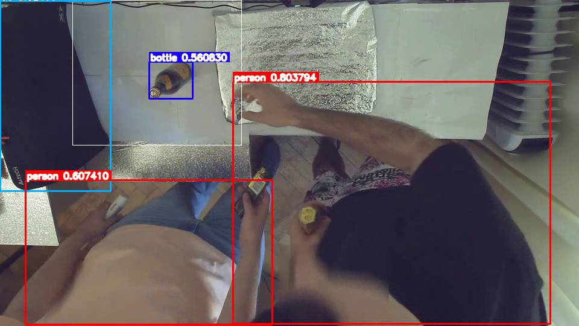

# Smoothr
Assignment task




For this assignment I picked transormer-based model [DEIM](https://github.com/ShihuaHuang95/DEIM).
Some say it beats all yolo models.

Another solid choice would be [yolov9](https://github.com/WongKinYiu/yolov9)

## Installation
Just create virtual environment, and install `requirements.txt` as usual:
```bash
python -m venv .venv
source .venv/bin/activate
pip install -r requirements.txt
```

Repo was tested on Ubuntu 22.04

## Usage
Repo is using [hydra](https://hydra.cc/) for configuration management. Please refer to it's documentation.

### Try run
You can run those scripts without any params to try out:

```bash
python -m src.scripts.process
python -m src.scripts.viz
python -m src.scripts.stats
```

### Run detector
To run detector on video:
```bash
python -m src.scripts.process\
    path=data/cam_2.mp4\
    dst=data/detections.parquet\
```

To run on interval from 100 to 200 frame and skip every 5 frames:
```bash
python -m src.scripts.process\
    video_config.start=100\
    video_config.end=100\
    video_config.skip=5
```

To run with the smallest DEIM model (deim_hgnetv2_n)

```bash
python -m src.scripts.process \
    model.model_name=deim_hgnetv2_n
```

For all params please see [configs](src/scripts/config/process.yaml)

### Visualize

```bash
python -m src.scripts.viz\
    video=data/cam_2.mp4\
    detections=data/detections.parquet\
    events=data/input_events.txt\
    labels=assets/label_names.csv\
    dst=data/output.mp4
```

Where `detections` are created via script from previous section. Other params are self-explanatory.

For all params please see [configs](src/scripts/config/viz.yaml)

### Calculate statistics

```bash
python -m src.scripts.stats\
    events=data/input_events.txt\
    detections=data/detections.parquet\
    dst=data/stats.csv\
```

For all params please see [configs](src/scripts/config/stats.yaml)

### Benchmark

On my GPU RTX 3060 60w (crippled for laptops gpu) with the largest model (`deim_hgnetv2_x`) it works for 19 fps.

You can set the smallest model (run with `model.model_name=deim_hgnetv2_n`) and it would work with 60-70 fps.
However, such small model being untrained doesn't detect anything meaningful

## Unit tests:

```bash
pytest .
```


## TODO:
- test
- benchmark
- yolov9
- logging
- DEIM inference via onnx-runtime
- visualize events from `input_events.txt`
- Streaming mode (if needed)
- Visualize frame number
- refactor statistics: simplify addition of new metrics

## Disclaimer
- Normally `data/` should be in `.gitignore`, but for demonstration purposes, I've added videos in git
- Unit tests were majorly implemented with the help of Claude 4 Opus
